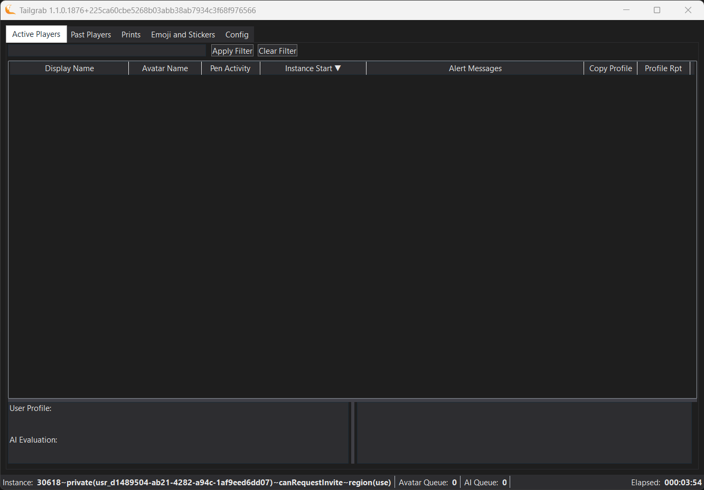
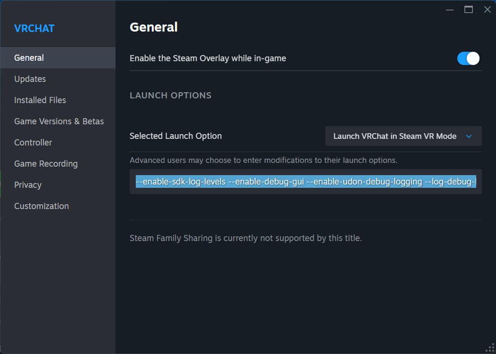

# Tailgrab
VRChat Log Parser and Automation tool to help moderators manage trouble makers in VRChat since VRChat Management Team is not taking moderation seriously; ever.

Tailgrab will read the VRChat Local Game Log files in real time, parse them for events and then trigger actions based on the configuration of the application.  The application is designed to be flexible and allow for a wide range of actions to be triggered based on the events that are parsed from the VRChat logs and alert the user to elements that may be less than honest.

[](./tailgrab_application.png)

## Features
- Shows a live feed of user in the current instance with their VRChat Avatar and UserID
- When in Furry Hideout, shows user's usage of Furry Hideout Pens
- Quick view of the user's historical avatar, pen, print, emoji and sticker usage in the current instance.
- AI powered insights on user Profile, Sticker, Emoji and Print content.
- Quick reporting of User's Profile to the in game moderation instance
- Quick reporting of User's Images to the in game moderation instance
- Copy Button that copies the user's VRChat User Id, Display name, Instance Stats and historical activity for pasting into your favorite moderation toolset.
- Avatar Flagging based on user directed database.
- Group Flagging based on user directed database.
- Historical tracking of User elapsed time seen from your usage of the application.
- Trigger actions based on VRChat log events of "Vote To Kick" or "Group Moderation Action (Kick/Warn)", such as sending OSC Avatar Parameters, sending keystrokes to other applications, etc.

## Installation

> [!NOTE]
> I am learing how to build a Installer for the appliction, but for now you will need to download the latest release and extract the zip file to a location of your choice on your Windows machine.  Then you can run the ```tailgrab.exe``` application to start monitoring your VRChat instance.

### New Install

> [!NOTE]
> Ensure you have extended logging enabled in VRChat by going to Steam > VR Chat > Settings (Gear Icon) > Properties.  Set the following into the Lauch Options.
> 
> [](./docs/SteamVRChatSettings.png)
>
>```--enable-sdk-log-levels --enable-debug-gui --enable-udon-debug-logging --log-debug-levels="Always;API;AssetBundleDownloadManager;ContentCreator;All;NetworkTransport;NetworkData;NetworkProcessing```
>
> This will expose more information in the VRChat logs that TailGrab can parse and use to provide more insights and trigger actions based on the events that are happening in your VRChat instance.


1. Download the latest release of TailGrab from the [Latest Release](https://github.com/jlong23/Tailgrab/releases/latest) page.
1. Extract the downloaded zip file to a location of your choice on your Windows machine.
1. Run the ```tailgrab.exe``` application to start monitoring your VRChat instance.

### Updgrade from Previous Version
1. Download the latest release of TailGrab from the [Latest Release](https://github.com/jlong23/Tailgrab/releases/latest) page.
1. Extract the downloaded zip file to a location of your choice on your Windows machine, but avoid overwriting your existing configuration & data files. ./config.json ./pen-network-id.csv ./sounds/* ./data/* 
1. Run the ```tailgrab.exe -upgrade``` application to start any database upgrades.
1. Configure any new Secrets and other configuration values that may be needed for new features added since your last version.
1. Restart the application with ```tailgrab.exe``` to start monitoring your VRChat instance with the new version of TailGrab.

## Configuration
[Application Config](./docs/Config_Application.md) for details on how to configure the application to connect to API services.

[Config Line Handlers](./docs/Config_LineHandlers.md) for details on how to configure the application to respond to VRChat local game log events.

## Quick Usage
Click the windows application or open a Powershell or Command Line prompt in your windows host, change directory to where ```tailgrab.exe``` has been extracted to and start it with:

```.\tailgrab.exe```

Or if you have moved where the VR Chat ```output_log_*.txt``` are located; then:

```.\tailgrab.exe -l {full path to VR Chat logs ending with a \}```

If you need to clear all registry settings stored for TailGrab, you can run:

```.\tailgrab.exe -clear```

This will remove all stored configuration and secret values from the Windows Registry for TailGrab, you can then reconfigure the application as needed, save them, restart and get back to watching the instance.

### VRChat Source Log Files

By default TailGrab will look for VRChat log files in the default location of:

```YourUserHome\AppData\LocalLow\VRChat\VRChat\```

This can be overridden by passing the full path to the VRChat log files as the first argument to the application.

```.\\tailgrab.exe D:\MyVRChatLogs\```

### Watching TailGrab Application Logs

The TailGrab application will log it's internal operations to the ```./logs``` folder in the same directory as the application executable.  Each run of the application will create a new log file with a timestamp in the filename.

If you want to watch the application logs in real time, you can use a tool like ```tail``` from Git Bash or ```Get-Content``` from Powershell session with the log filename.

```Get-Content -Path .\logs\tailgrab-2026-01-26.log -wait```

## Usefull Tool Sets 

DB Browser for SQLite - https://sqlitebrowser.org/


## Detail Documentation

[Active Players](./docs/Application_Tab_ActivePlayers.md) Current Players in the Instance.

[Past Players](./docs/Application_Tab_PastPlayers.md) Players that have been in the instance since you started TailGrab for the last 15 minutes.

[Prints](./docs/Application_Tab_Prints.md) Shows Prints that have been spawned into the instance by time/user id.

[Emojis & Stickers](./docs/Application_Tab_Emojis_and_Stickers.md) Shows Emojis and Stickers that have been spawned into the instance by time/user id.

[Config Tab, Avatars](./docs/Config_Avatars.md) Mark Avatars for Alerting and Blocking.

[Config Tab, Groups](./docs/Config_Groups.md) Mark Groups for Alerting and Blocking.

[Config Tab, Users](./docs/Config_Users.md) See user activity you have encountered.

[Config Tab, Line Handlers](./docs/Config_LineHandlers.md) Configure Actions to Trigger based on VRChat Log Events.

[Config Tab, Secrets](./docs/Config_Application.md) Configure API Keys and other application settings.

[Config Tab, Alerts](./docs/Config_Alerts.md) Configure Alert Levels sounds and highlight colors.

