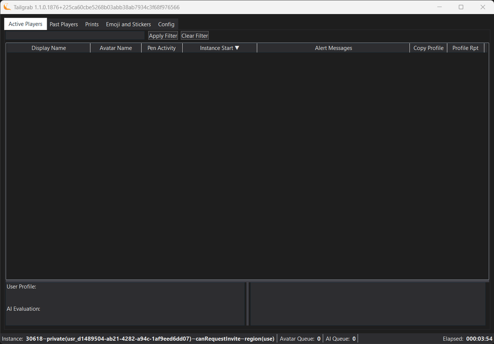
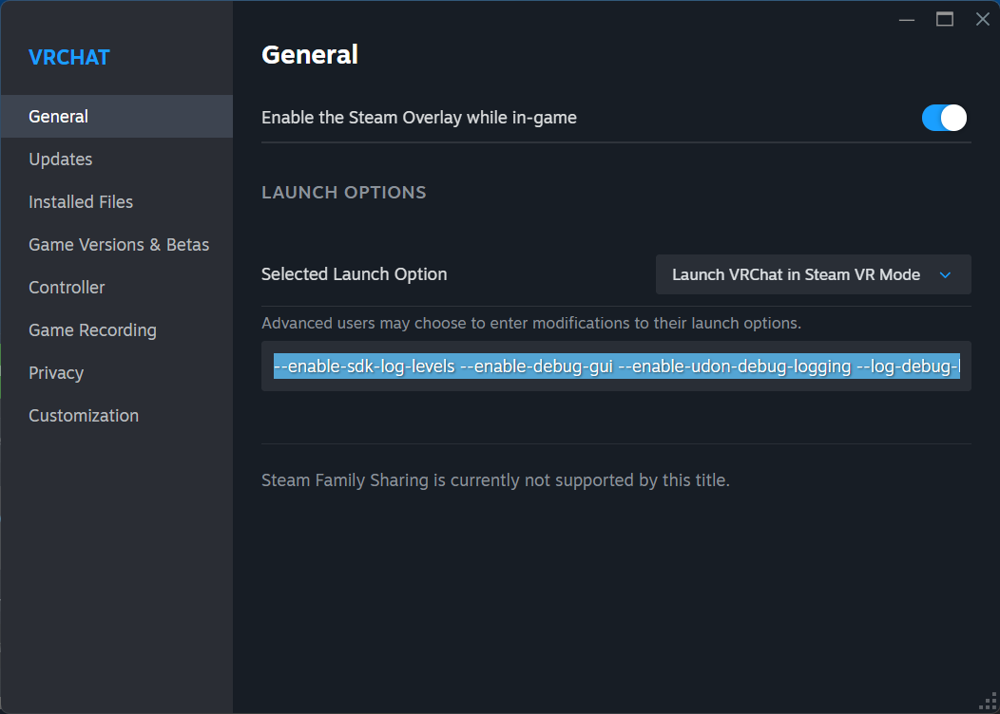

# Tailgrab
VRChat Log Parser and Automation tool to help moderators manage trouble makers in VRChat since VRChat Management Team is not taking moderation seriously; ever.

Tailgrab will read the VRChat Local Game Log files in real time, parse them for events and then trigger actions based on the configuration of the application.  The application is designed to be flexible and allow for a wide range of actions to be triggered based on the events that are parsed from the VRChat logs and alert the user to elements that may be less than honest.

[](./docs/tailgrab_application.png)

## Features
- Shows a live feed of user in the current instance with their VRChat Avatar and UserID
- Quick view of the user's historical avatar, print, emoji and sticker usage in the current instance.
- AI powered insights on user Profile, Sticker, Emoji and Print content.
- Quick reporting of User's Profile to the in game moderation instance
- Quick reporting of User's Images to the in game moderation instance
- Copy Button that copies the user's VRChat User Id, Display name, Instance Stats and historical activity for pasting into your favorite moderation toolset.
- Avatar Flagging based on user directed database.
- Group Flagging based on user directed database.
- Historical tracking of User elapsed time seen from your usage of the application.
- Trigger actions based on VRChat log events of "Vote To Kick" or "Group Moderation Action (Kick/Warn)", such as sending OSC Avatar Parameters, sending keystrokes to other applications, etc.

## Installation

> [!IMPORTANT]
> The new way is using the Installer/Uninstaller.  This will move all your configuration and data files to the new location of ```{UserProfile}/AppData/Local/Tailgrab/```; 
> if you have made changes to the:
>   - ```./config.json```
>	- ```NLog.config``` -- Note that there is a change for logging write by 'Session Start Time'
>	- ```pen-network-id.csv``` 
> Then they will need to be move to the new location of ```{UserProfile}/AppData/Local/Tailgrab/``` after the installation.  
>	- If you have made changes to the ```./sounds/*``` you will need to move to the sounds to the ```{UserProfile}/AppData/Local/Tailgrab/sounds/``` after the installation.
>   - There is new settings for alert sounds per type and severity, so you may want to configure those in the Config->Alerts.
>
> **Don't forget to save on each page and restart the application.**
>
>	- The database file structure has changed in the new version, install the application and set up your new settings, then close the application and run the command line migration tool to load all the old data from the old database file to the new database file.  
> ```
> .\migration.exe D:\dev\TailGrab\bin\Release\net10.0-windows\win-x64\publish\data\avatars.sqlite
> Successfully validated database at: D:\dev\TailGrab\bin\Release\net10.0-windows\win-x64\publish\data\avatars.sqlite
> Migration to V1.1.0
> Database path: C:\Users\{user}\AppData\Local\Tailgrab\data\tailgrab.db
> Database connection successful!
> Table 'AvatarInfo' has 19607 records.
> Migrated 0 records from 'AvatarInfo' to new database.
> Table 'GroupInfo' has 73529 records.
> Migrated 57616 records from 'GroupInfo' to new database.
> Table 'UserInfo' has 13608 records.
> Migrated 13345 records from 'UserInfo' to new database.
> Table 'ProfileEvaluation' has 9764 records.
> Migrated 9674 records from 'ProfileEvaluation' to new database.
> Table 'ImageEvaluation' has 705 records.
> `Migrated 675 records from 'ImageEvaluation' to new database.
> ```
>

### New Install

> [!IMPORTANT]
> Ensure you have extended logging enabled in VRChat by going to Steam > VR Chat > Settings (Gear Icon) > Properties.  Set the following into the Lauch Options.
> 
> [](./docs/SteamVRChatSettings.png)
>
>```--enable-sdk-log-levels --enable-debug-gui --enable-udon-debug-logging --log-debug-levels="Always;API;AssetBundleDownloadManager;ContentCreator;All;NetworkTransport;NetworkData;NetworkProcessing```
>
> This will expose more information in the VRChat logs that TailGrab can parse and use to provide more insights and trigger actions based on the events that are happening in your VRChat instance.


1. Download the latest release of TailGrab from the [Latest Release](https://github.com/jlong23/Tailgrab/releases/latest) page.
1. Extract the downloaded zip file to a location of your choice on your Windows machine.
1. Run the ```tailgrab.exe``` application to start monitoring your VRChat instance.

### Updgrade from Previous Version
1. Download the latest release of TailGrab from the [Latest Release](https://github.com/jlong23/Tailgrab/releases/latest) page.
1. Extract the downloaded zip file to a location of your choice on your Windows machine, but avoid overwriting your existing configuration & data files. ./config.json ./pen-network-id.csv ./sounds/* ./data/* 
1. Run the ```tailgrab.exe -upgrade``` application to start any database upgrades.
1. Configure any new Secrets and other configuration values that may be needed for new features added since your last version.
1. Restart the application with ```tailgrab.exe``` to start monitoring your VRChat instance with the new version of TailGrab.


### Where is everything now

The Application Folder is now under ```\Program Files (x86)\Devious Fox Enterprises\Tailgrab```; this is where the application executable and all the support DLLs are stored.  You can use the Uninstaller to remove the application as needed.

Your configuration and data files are now stored under ```{UserProfile}/AppData/Local/Tailgrab/```; 

```
...\AppData\
      Local\
         Tailgrab\
            config.json
            pen-network-id.csv
            NLog.config
            sounds\
               alert_sound.wav
               alert_sound_2.wav
               alert_sound_3.wav
            data\
               tailgrab.db
			logs\
               tailgrab_2026-02-28_12-00-00.log
```

## Configuration
[Application Config](./docs/Config_Application.md) for details on how to configure the application to connect to API services.

[Config Line Handlers](./docs/Config_LineHandlers.md) for details on how to configure the application to respond to VRChat local game log events.

## Quick Usage

> [!IMPORTANT]
> By default TailGrab will look for VRChat log files in the default location of ```{UserProfile}\AppData\LocalLow\VRChat\VRChat\```, and should pick up any log files that are created on the same date Tailgrab is being run.  Meaning you can restart Tailgrab while VRC is running and rejoin the instance to repopulate the active players.  If you do this in a low activity instance, aka homeworld; you may need to do the 'Rejoin' as soon as possible to ensure the pickup of the logfile.  Tailgrab will pick all other log files for that day, but if there is no activity in the log since the startup from 15 minutes ago, then tailgrab will close and ignore the file for performance reasons.

Click the windows application or open a Powershell or Command Line prompt in your windows host, change directory to where ```tailgrab.exe``` has been extracted to and start it with:

```.\tailgrab.exe```

Or if you have moved where the VR Chat ```output_log_*.txt``` are located; then:

```.\tailgrab.exe -l {full path to VR Chat logs ending with a \}```

If you need to clear all registry settings stored for TailGrab, you can run:

```.\tailgrab.exe -clear```

This will remove all stored configuration and secret values from the Windows Registry for TailGrab, you can then reconfigure the application as needed, save them, restart and get back to watching the instance.

### VRChat Source Log Files

By default TailGrab will look for VRChat log files in the default location of:

```<YourUserHome>\AppData\LocalLow\VRChat\VRChat\```

This can be overridden by passing the full path to the VRChat log files as the first argument to the application.

```.\tailgrab.exe -l D:\MyVRChatLogs\```

### Watching TailGrab Application Logs

The TailGrab application will log it's internal operations to the ```{UserProfile}/AppData/Local/Tailgrab/logs/``` folder in the same directory as the application executable.  Each run of the application will create a new log file with a timestamp in the filename.

If you want to watch the application logs in real time, you can use a tool like ```tail``` from Git Bash or ```Get-Content``` from Powershell session with the log filename.

```Get-Content -Path (Get-ChildItem -Path $HOME\AppData\Local\Tailgrab\logs\ -File | Sort-Object LastWriteTime -Descending | Select-Object -First 1).FullName -Wait -Tail 20```

### Bulk Editing of Database Files

The TailGrab SQLite database will stored to the ```{UserProfile}/AppData/Local/Tailgrab/data/tailgrab.db``` path.

#### Usefull Tool Sets 

DB Browser for SQLite - https://sqlitebrowser.org/

##### Export SQL For GIST or Team Share

Avatars:

```SQL
SELECT 
	'"' || AvatarId || '","' || AvatarName || '","' || 
	CASE 
		WHEN alertType = 1 THEN 'Watch' 
		WHEN alertType = 2 THEN 'Nuisance' 
		WHEN alertType = 3 THEN 'Crasher' 
		ELSE 'NONE' 
	END || '"' AS GISTLine 
	FROM AvatarInfo 
	WHERE alertType > 0 
	ORDER BY AvatarName
```

My Avatars GIST Export URL:
```
https://gist.githubusercontent.com/jlong23/b4d0d55eaafeffe40e3cffd3da0b2e3b/raw/TG_Avatar.txt
```

Groups: 

```SQL
SELECT 
	'"' || GroupId || '","' || GroupName || '","' || 
	CASE 
		WHEN alertType = 1 THEN 'Watch' 
		WHEN alertType = 2 THEN 'Nuisance' 
		WHEN alertType = 3 THEN 'Crasher' 
		ELSE 'NONE' 
	END || '"' AS GISTLine 
	FROM GroupInfo 
	WHERE alertType > 0 
	ORDER BY GroupName
```

My Groups GIST Export URL:
```
https://gist.githubusercontent.com/jlong23/2b051df849cabb4da273eaf98225ae4e/raw/TG_Group.txt
```

## Detail Documentation

[Active Players](./docs/Application_Tab_ActivePlayers.md) Current Players in the Instance.

[Past Players](./docs/Application_Tab_PastPlayers.md) Players that have been in the instance since you started TailGrab for the last 15 minutes.

[Prints](./docs/Application_Tab_Prints.md) Shows Prints that have been spawned into the instance by time/user id.

[Emojis & Stickers](./docs/Application_Tab_Emojis_and_Stickers.md) Shows Emojis and Stickers that have been spawned into the instance by time/user id.

[Config Tab, Avatars](./docs/Config_Avatars.md) Mark Avatars for Alerting and Blocking.

[Config Tab, Groups](./docs/Config_Groups.md) Mark Groups for Alerting and Blocking.

[Config Tab, Users](./docs/Config_Users.md) See user activity you have encountered.

[Config Tab, Line Handlers](./docs/Config_LineHandlers.md) Configure Actions to Trigger based on VRChat Log Events.

[Config Tab, Secrets](./docs/Config_Application.md) Configure API Keys and other application settings.

[Config Tab, Alerts](./docs/Config_Alerts.md) Configure Alert Levels sounds and highlight colors.

[Config Tab, Migrations](./docs/Config_Migrations.md) Migrate V1.0.9 Database to the new database.
