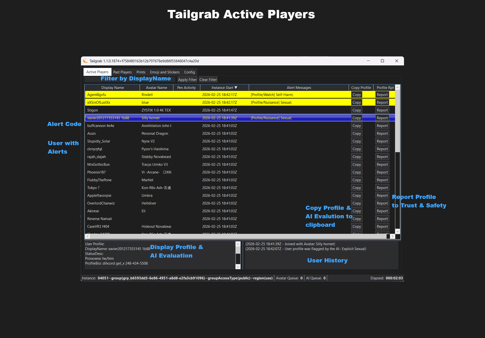

# Active Player Tab

The Active Player tab shows the players that are currently active in the game. It displays their name, userid, and current avatar, Pen Activity/Alerts, Instance Start (When you see them first in the instance), Copy Profile button and Report Profile button.

Below the Tab, the panel there is a search box that allows you to filter the list of active players by name. Enter a partial name and click 'Apply Filter' or click 'Clear Filter'

Below that the list of active players in the instance. You can click on a player to view their profile and historical activity on the two bottom text boxes. The left box shows the player's profile and AI Evaluation, while the right box shows the historical avatar; emoji, sticker and print usage.  The Column Header when clicked will sort the column; the default is "Instance Start" Decending.

The Copy Profile button allows you to copy the player's profile information to your clipboard, while the Report Profile button allows you to report the player for any inappropriate content using the VR Chat in-game reporting system. When you click the Report Profile button, it will open the a dialog mimicing the VR Chat reporting page as a model dialog with the player's information and reporting values pre-filled. 

The very bottom of the panel is the Status Bar, which shows the avatar processing queue size, how many players are waiting for an Ollama evaluation, the Instance Id and Elapsed time in this instance.

