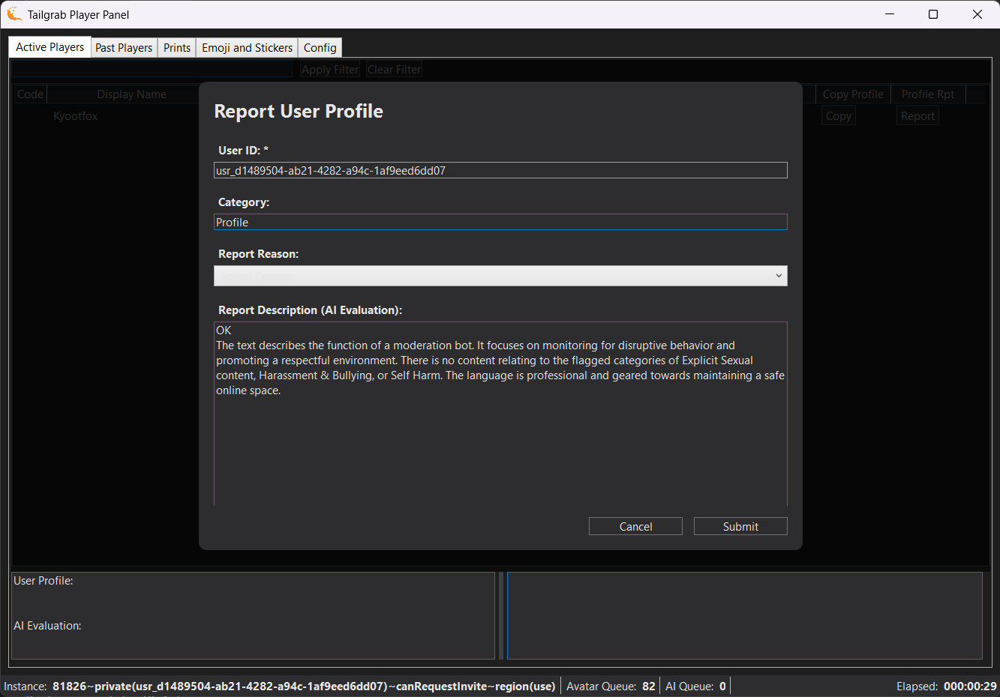

[Back](../README.md)
# Active Player Tab

The Active Player tab shows the players that are currently active in the game. It displays their name, userid, and current avatar, Pen Activity/Alerts, Instance Start (When you see them first in the instance), Copy Profile button and Report Profile button.

Below the Tab, the panel there is a search box that allows you to filter the list of active players by name. Enter a partial name and click 'Apply Filter' or click 'Clear Filter'

Below that the list of active players in the instance. You can click on a player to view their profile and historical activity on the two bottom text boxes. The left box shows the player's profile and AI Evaluation, while the right box shows the historical avatar; emoji, sticker and print usage.  The Column Header when clicked will sort the column; the default is "Instance Start" Decending.

The _**Alerts**_ column indicates an alert state for the player. If there are no alerts, the column will be blank.  Any player that has any alert will be highlighted accoring to the sevarity of the alert.

Format of the alerts contains [{Classification}/{Alert Type}] {Reason} where Classification is either "Profile", "Avatar", "Group", "Print" or "Emoji/Sticker".  Alert Type is the severity level of the alert you assigned in the configuration areas.  Prints, Stickers and Emojis are only flagged when there is a Ollama Key and the evaluation is done successfuly with the supplied prompt.

The Copy Profile button allows you to copy the player's profile information to your clipboard, while the Report Profile button allows you to report the player for any inappropriate content using the VR Chat in-game reporting system. When you click the Report Profile button, it will open the a dialog mimicing the VR Chat reporting page as a model dialog with the player's information and reporting values pre-filled. 

Below the list of active players, there are two text boxes. The left box shows the player's profile and AI Evaluation, while the right box shows the historical avatar; emoji, sticker and print usage, these text boxes will update when you click on a player in the list above. If no player is selected, the left box will show "Select a player to view their profile and AI evaluation" and the right box will show "Select a player to view their historical avatar, emoji, sticker and print usage."  These text boxes are horizontaly and verticaly resisable in the panel.

The very bottom of the panel is the Status Bar, which shows the avatar processing queue size, how many players are waiting for an Ollama evaluation, the Instance Id and Elapsed time in this instance.

The Report Profile dialog allows you to report a player for any inappropriate content using the VR Chat in-game reporting system. When you click the Report Profile button, it will open the a dialog mimicing the VR Chat reporting page as a model dialog with the player's information and reporting values pre-filled. You can select the reason for reporting from the dropdown menu, and add any additional comments in the text box provided. Once you have filled out the necessary information or accept the AI evalutation, click the "Submit Report" button to send your report to VR Chat or "Cancel" to not send the report.
