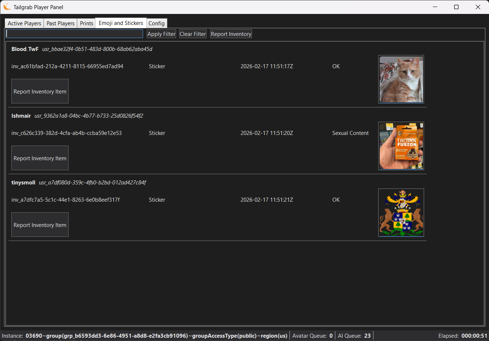
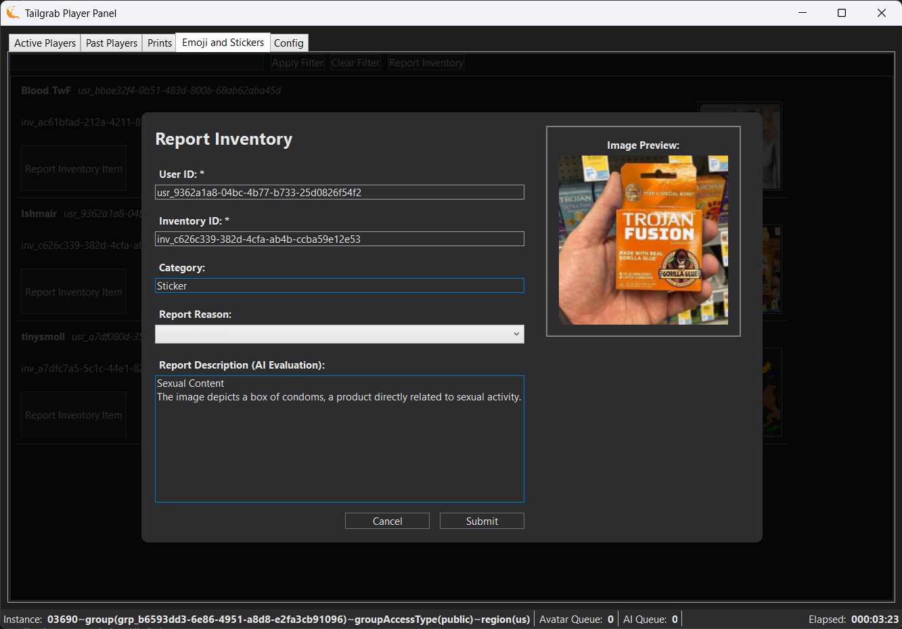

[Back](../README.md)
# Emojis and Stickers Tab

The Emojis and Stickers tab shows the player images that have been emoted into the instance.  

Below the Tab, the panel there is a search box that allows you to filter the list of players by name. Enter a partial name and click 'Apply Filter' or click 'Clear Filter'

> [!NOTE]
> You can report a emoji or sticker if you have it's inventory id **inv_1234...** and user id **usr_1234...**.

Next to the search elements is the "Report Inventory" button, which allows you to report any prior Emoji or Sticker for any inappropriate content using the VR Chat in-game reporting system. When you click the Report Print button, it will open the a dialog mimicing the VR Chat reporting page as a model dialog with the print's information and reporting values pre-filled. You can select the reason for reporting from the dropdown menu, and add any additional comments in the text box provided. Once you have filled out the necessary information or accept the AI evalutation, click the "Submit Report" button to send your report to VR Chat or "Cancel" to not send the report.

Below that the list of Emojis and Sticker by players in or have been in the instance.

Report Inventory button allows you to report the emoji or sticker for any inappropriate content using the VR Chat in-game reporting system. When you click the Report Print button, it will open the a dialog mimicing the VR Chat reporting page as a model dialog with the print's information and reporting values pre-filled. You can select the reason for reporting from the dropdown menu, and add any additional comments in the text box provided. Once you have filled out the necessary information or accept the AI evalutation, click the "Submit Report" button to send your report to VR Chat or "Cancel" to not send the report.

The Report Inventory dialog allows you to report a print through the ingame reporting API.

- User Id: The unique identifier for the user who dropped the emoji or sticker, which is used to report the cdontent to VR Chat.  Editable for user to input a user id they want to report.
- Inventory Id: The unique identifier for the inventory item, which is used to report the content to VR Chat.  Editable for user to input a inventory id they want to report.
- Category: Either "Sticker" or "Emoji" based on the Inventory record.
- Report Reason: The reason for reporting the content, which can be selected from a dropdown menu of predefined reasons.
- Report Description: A text box where you can provide additional details about the reason for reporting the content or accept the AI evaluation of the print.
- Image Preview: A preview of the content image that is being reported, which can help you determine if the content is inappropriate and should be reported.

- Submit Report Button: A button that allows you to submit the report to VR Chat once you have filled out the necessary information or accept the AI evaluation.
- Cancel Button: A button that allows you to cancel the report and not send it to VR Chat.