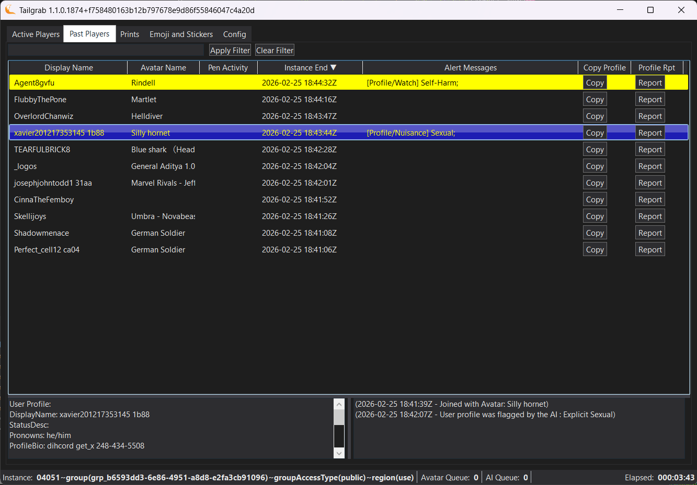

[Back](../README.md)
# Past Player Tab

The Past Player tab shows the players that have left the current instance. It displays their name, userid, and last avatar, Pen Activity/Alerts, Instance Start (When you see them first in the instance), Copy Profile button and Report Profile button.

Below the Tab, the panel there is a search box that allows you to filter the list of active players by name. Enter a partial name and click 'Apply Filter' or click 'Clear Filter'

Below that the list of past players in the instance for the past 15 minutes.

The Copy Profile button allows you to copy the player's profile information to your clipboard, while the Report Profile button allows you to report the player for any inappropriate content using the VR Chat in-game reporting system. When you click the Report Profile button, it will open the a dialog mimicing the VR Chat reporting page as a model dialog with the player's information and reporting values pre-filled. 
