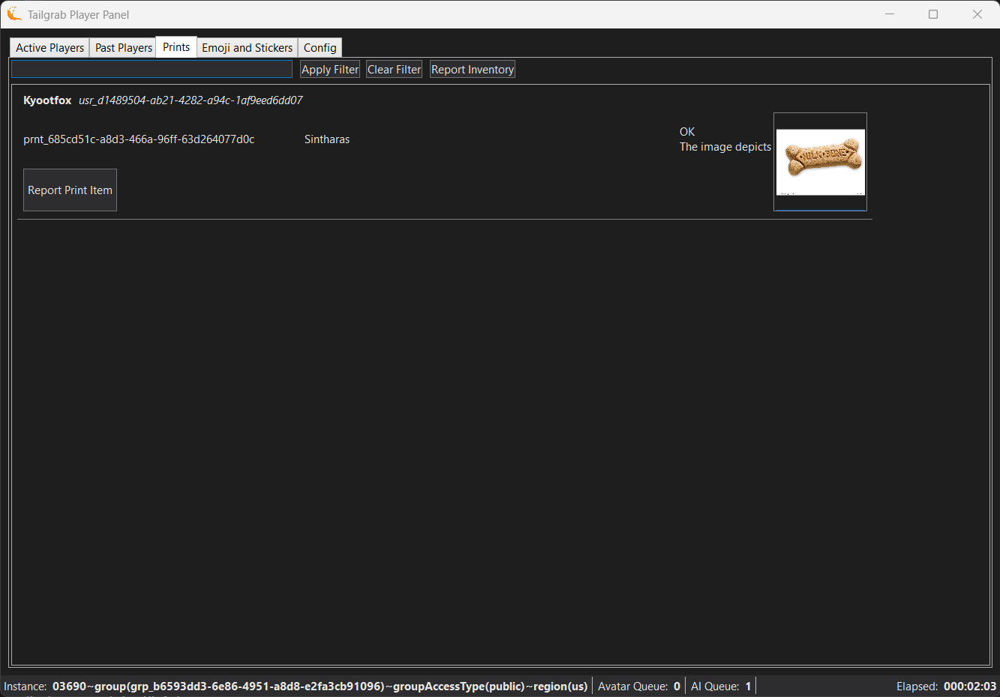
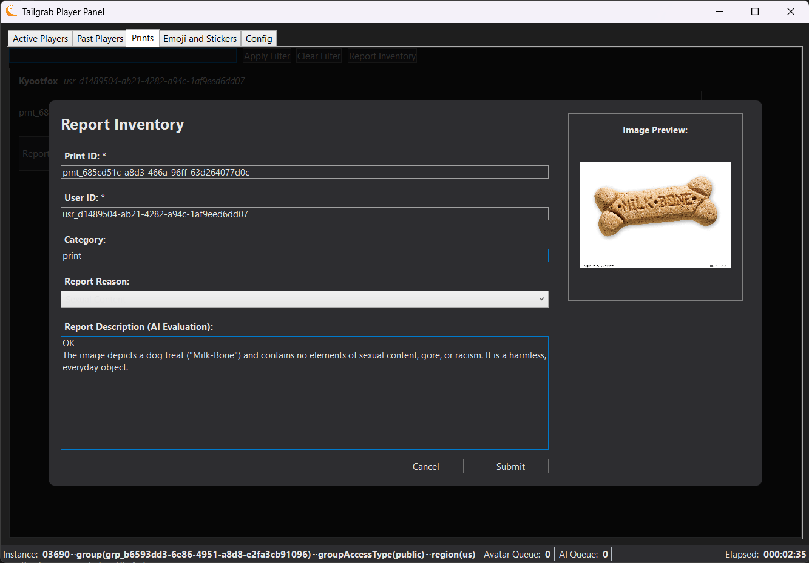

[Back](../README.md)
# Prints Tab

The Prints tab shows the player prints that have been dropped into the instance.  

Below the Tab, the panel there is a search box that allows you to filter the list of players by name. Enter a partial name and click 'Apply Filter' or click 'Clear Filter'

> [!NOTE]
> You can report a prior print if you have it's print id **prnt_1234...**.

Next to the search elements is the "Report Inventory" button, which allows you to report any prior print for any inappropriate content using the VR Chat in-game reporting system. When you click the Report Print button, it will open the a dialog mimicing the VR Chat reporting page as a model dialog with the print's information and reporting values pre-filled. You can select the reason for reporting from the dropdown menu, and add any additional comments in the text box provided. Once you have filled out the necessary information or accept the AI evalutation, click the "Submit Report" button to send your report to VR Chat or "Cancel" to not send the report.

Below that the list of Prints by players in or have been in the instance.

Report Print button allows you to report the print for any inappropriate content using the VR Chat in-game reporting system. When you click the Report Print button, it will open the a dialog mimicing the VR Chat reporting page as a model dialog with the print's information and reporting values pre-filled. You can select the reason for reporting from the dropdown menu, and add any additional comments in the text box provided. Once you have filled out the necessary information or accept the AI evalutation, click the "Submit Report" button to send your report to VR Chat or "Cancel" to not send the report.

The Report Print dialog allows you to report a print through the ingame reporting API.

- Print Id: The unique identifier for the print, which is used to report the print to VR Chat.  Editable for user to input a print id they want to report.
- User Id: The unique identifier for the user who dropped the print, which is used to report the print to VR Chat.
- Category: Always "print" for print reports.
- Report Reason: The reason for reporting the print, which can be selected from a dropdown menu of predefined reasons.
- Report Description: A text box where you can provide additional details about the reason for reporting the print or accept the AI evaluation of the print.
- Image Preview: A preview of the print image that is being reported, which can help you determine if the print is inappropriate and should be reported.

- Submit Report Button: A button that allows you to submit the report to VR Chat once you have filled out the necessary information or accept the AI evaluation.
- Cancel Button: A button that allows you to cancel the report and not send it to VR Chat.