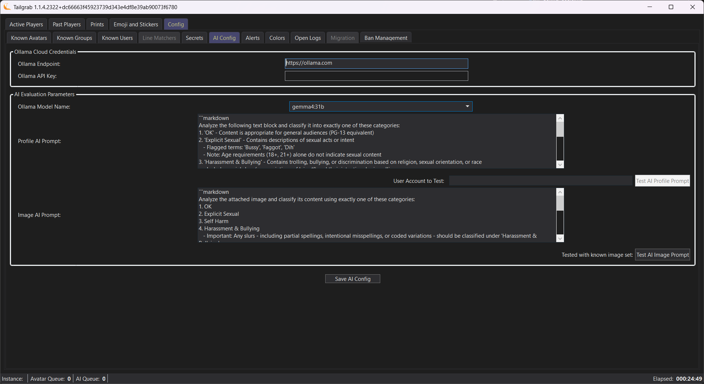

[Back](../README.md)
# AI Config


[](./tailgrab_tab_config_ai_config.png)


## Ollama Cloud AI API Credentials & Configuration

OLLama Cloud AI services are used to evaluate user profiles for potential bad actors based on your custom prompt criteria.  The OLLama API is called only once for a MD5 checksummed profile or Image to reduce API usage calls and cost.

> [!IMPORTANT]
> Ollama Cloud API is free at this time! (2026/02)  but may have usage limits any time; User credentials are stored in an encrypted format in the Windows Registry and used only to check on user content that has not been checked before for users in the instance you are in.  Sign up at https://signin.ollama.com/ and see current pricing models https://ollama.com/pricing

**Ollama Endpoint** - is the URL to your Ollama API instance, if you are using the cloud service, this should be ```https://ollama.com``` to use the cloud default, if you are using a local instance of Ollama, this should be ```http://localhost:11434``` or the URL of the host that Ollama is installed in.

> [!NOTE]
> You can use a Localy installed Ollama instance with a API Endpoint of ```http://localhost:11434``` or the URL of the host that Ollama is installed in. You will still need to key an API Key, but it's contents do not matter.

**Ollama API Key** - is the API Key generated from your Ollama Cloud account, this is used to authenticate your API calls to the Ollama Cloud service, if you are using a local instance of Ollama, this can be any value as the local instance does not require authentication.

> [!NOTE]
> If the Ollama API Key is not set, no profile evaluation will be done and the application will not attempt to call the API, so you can use the profile evaluation features without setting up the API credentials if you want to just use it as a local database of good and bad actors.


## AI Evaluation Parameters

**Ollama Model Name** - This is the name of the model you have set up in your Ollama Cloud account that you want to use for profile evaluation, ```gemma4:31b``` has been selected to give a good balance of performance and cost, but you can use any model you have set up in your account.  This dropdown is populated once you have a active Ollama Key or using LocalHost instance.


### Profile Evaluation Prompt
**Profile AI Prompt** - This is the custom prompt that you want to use for profile evaluation, you can use any prompt you want, but it should be designed to elicit semi formated response of 

```
<classification>
<Reasoning For you and VR Chat>
```

The default prompt is designed to look for potential sexual predators, but you can customize it to look for any criteria you want as so long as the reponse contains the classification on the first line and anything else on the rest.  The Classifcations are based on VR Chat's Moderation Categories.

|Classifcation | What it should look for |
|--------|--------|
| OK | Default value of nothing of interest in the profile. |
| Explicit Sexual | Any content that should not be in a PG13 instance |
| Harassment & Bullying | Any content that would be considered trolling based on Religion, Race  or Sexual Orientation |
| Self Harm | Any content that could be considered a cry for help |

> [!TIP]
> The Classification names are set, but how you word the prompt can get the AI to be as leinent or as strict as you want, you can also add more classifications if you want, just make sure to include them in the prompt and have the AI respond with the classification on the first line of the response for the application to parse it correctly.  You can also use the reasoning section to give you more context on why the AI classified it a certain way, this can be helpful when you are on the fence about a user and want to make a judgement call on whether to report them or not.

> [!NOTE]
> The system puts the Prompt plus the user profile information into the Generate API call, the full format is:
> ```
> {UserAIPrompt}
> DisplayName: {displayName}
> DisplayName: {profile.DisplayName}
> StatusDesc: {profile.StatusDescription}
> Pronowns: {profile.Pronouns}
> ProfileBio: {profile.Bio}
> ```

> [!NOTE]
> The current prompt is defined as:
> From the following block of text, classify the contents into a single class from the following classes;\r\n'OK' - Where as all text content can be considered PG13;\r\n'Explicit Sexual' - Where as any of the text contained describes sexual acts or intent. Flagged words Bussy, Fagot, Dih;\r\n'Harassment & Bullying' - Where the text is describing acts of trolling or bullying users on Religion, Sexual Orientation or Race. Flagged words of base nigg* and variations of that spelling to hide racism.\r\n'Self Harm' - Any part of the text where it explicitly describes destructive behaviours.\r\nIf there is not enough information to determine the class, use a default of OK. When replying, return a single line for the Classification and a carriage return, then place the reasoning on subsequent lines, translate any foreign language to English:

**User Account to Test** - The text box here can allow you to pull a user profile from VRChat and test the prompt live.  This is a overlay page to view the results, click 'close' button to return to the panel.

### Image Evaluation Prompt

**Image AI Prompt** - This is the custom prompt that you want to evaluate images (Emoji & Stickers), you can use any prompt you want, but it should be designed to elicit semi formated response of 

```
<classification>
<Reasoning For you and VR Chat>
```

> _**Example Response for a NSFW Image:**_
> ```
> Sexual Content
> The image depicts anthropomorphic animals in a suggestive and sexually explicit situation with clear implications of sexual assault. This falls under the category of sexual content due to the nature of the depicted act and suggestive poses.
> ```

The default prompt is designed to look for potential PG13 violation, but you can customize it to look for any criteria you want as so long as the reponse contains the classification on the first line and anything else on the rest.  The Classifcations are based on VR Chat's Moderation Categories.

|Classifcation | What it should look for |
|--------|--------|
| OK | Default value of nothing of interest in the profile. |
| Explicit Sexual | Any content that should not be in a PG13 instance |
| Harassment & Bullying | Any content that would be considered trolling based on Religion, Race  or Sexual Orientation |
| Self Harm | Any content that could be considered a cry for help |


> [!TIP]
> The Classification names are set, but how you word the prompt can get the AI to be as leinent or as strict as you want, you can also add more classifications if you want, just make sure to include them in the prompt and have the AI respond with the classification on the first line of the response for the application to parse it correctly.  You can also use the reasoning section to give you more context on why the AI classified it a certain way, this can be helpful when you are on the fence about a user and want to make a judgement call on whether to report them or not.

> [!NOTE]
> The system puts the Prompt plus attached copy of the Image thumbnail for evaluation:

**Test with known image set** - The button will run the image evaluation prompt against a known set of images that have been classified as OK, Explicit Sexual, Harassment & Bullying and Self Harm.  The results will be displayed in a overlay page, click 'close' button to return to the panel.

- You can remove or add images to the test set by placing them in the ```Test-Images``` folder in the local/tailgrab configuration directory.  The images should be named with the classification as the prefix, for example: ```Explicit Sexual - image1.png``` or ```OK - image2.png```.  The application will parse the prefix to determine what the expected classification is for that image.

> [!NOTE]
> The file size and quantity of images affect the time it takes to run the test, so be careful when adding a large number of images to the test set.  The application will display the results of the test in a overlay page, click 'close' button to return to the panel.

