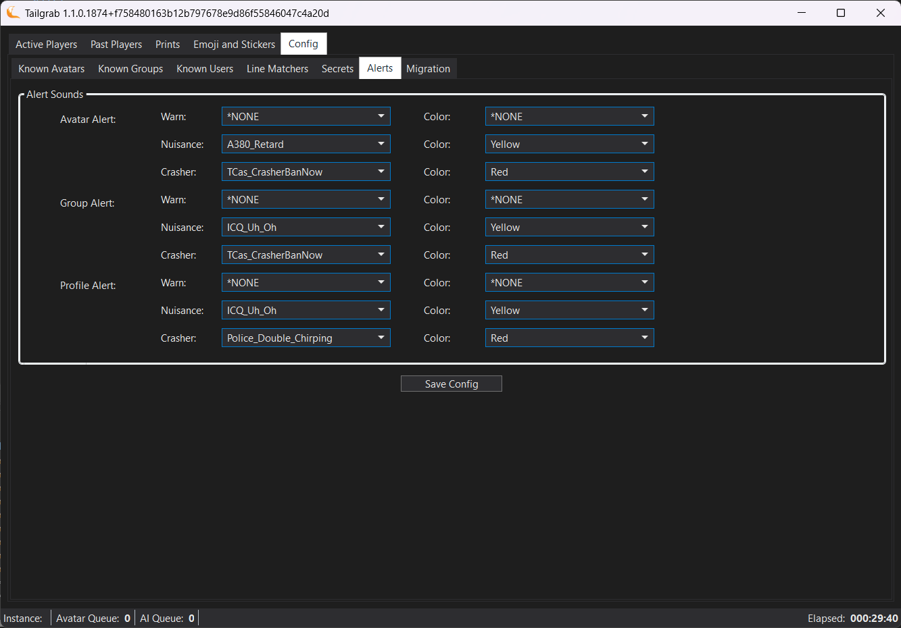

[Back](../README.md)
# Application Alerts

The TailGrab Alerts configuration panel is on the "Config" tab and then the "Alerts" sub-tab.

[](./tailgrab_tab_config_alerts.png)

## Alert Sounds / Color Style

Based on the three areas of interest, you can customize the alert sounds that are player.  The first set are windows default alert sounds while the application will add any sound file (WAV, MP3 or OGG) that exist under the application installed directory under ```./sounds```

**Avatar Alert** - This sound is played when an Avatar is detected in the instance that flagged with a Severity Level, and each severity level with a sound and color selection.

**Group Alert** - This sound is played when a user in the instance that flagged with a Severity Level, and each severity level with a sound and color selection.

**Profile Alert** - This sound is played when a user in the instance has a profile or Image that is evaluated by the AI services to be of concern based on your custom prompt criteria.

> [!NOTE]
> The Profile Alert Severity Levels are hard coded to:
>
> Harrassment & Bullying - **AlertTypeEnum.Nuisance**
>
> Sexual Content - **AlertTypeEnum.Nuisance**
>
> Self Harm - **AlertTypeEnum.Watch**