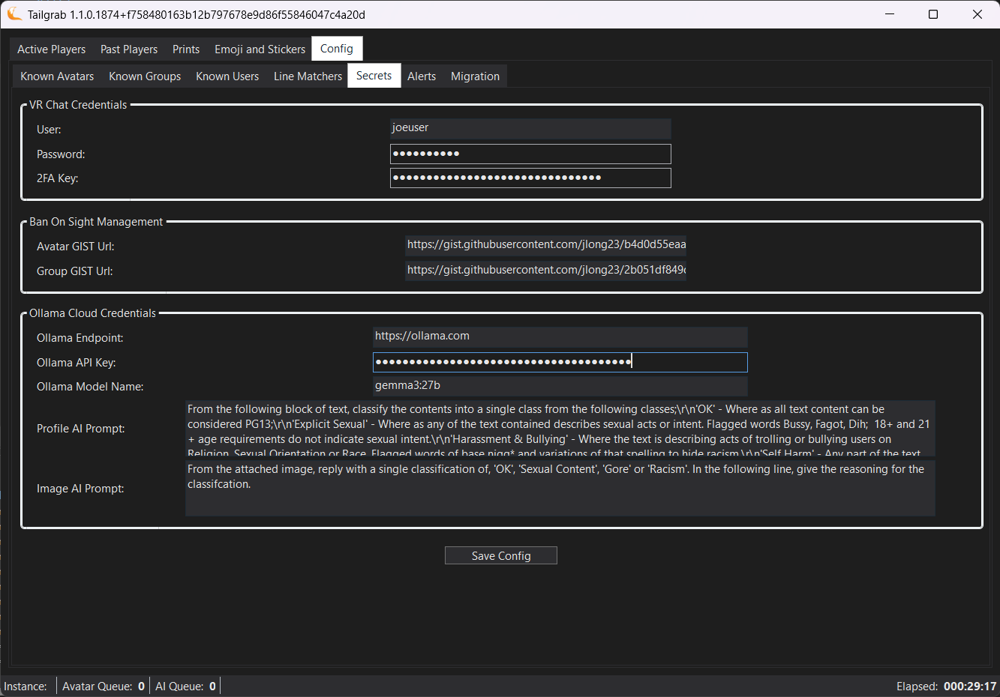

[Back](../README.md)
# Application Configuration

The TailGrab application configuration panel is on the "Config" tab and then the "Secrets" sub-tab.  All passwords and API keys protected, entering the configuration section hides the values so they cannot be coppied by shoulder surfers or screen recording software.  The values are stored in the Windows Registry in an encrypted format and are loaded on application start.  Hidden values are only written to the registry when there is a new value in the field and you click the "Save Secrets" button, so you can enter your credentials, save them, and then restart the application to get the services working properly.

The TailGrab application will look for the following credentials to connect to your VRChat API and OLLama AI services from the Windows Registry in a encyrpted format.  On the first Run you may receive a Popup Message to set the values on the Config -> Secrets Tab and restart the application to get the services running properly.

[](./tailgrab_tab_configuration.png)

## VR Chat API Credentials

Tailgrab uses VR Chat's public API to get information about avatars for the BlackListed Database (SQLite Local DB) and to get user profile infoformation for Profile Evaluation with the AI services.

The fields are your Web User Name and Password for VRChat, and the 2 Factor Authentication Key that is generation on account creation or enabling two factor authentication.

**User** - This is your VRChat Username you use to log in to the VRChat website.

**Password** - This is your VRChat Password you use to log in to the VRChat website.

**2FA Key** - This is the [2 Factor Authentication Key](https://docs.vrchat.com/docs/setup-2fa) that is generated when you set up 2 Factor Authentication on your VRChat account, this is used to generate the 2FA codes that are required to authenticate with the VRChat API.  You can see the Key on setup when you see the QRCode there is a link **enter the key manually**; copy this code to a note for entry into Tailgrab.  Lastpass Authenticator allows you to view this code with the edit site button.

> [!IMPORTANT]
> VRChat's API is not officially supported for third party applications, and may change/break at any time; User credentials are stored in an encrypted format in the Windows Registry and used only to gather needed information about users in the instance you are in.
> This API is used to get Avatar Information, Profile Information and to Report User profiles and Stickers and Emojis to VRChat Moderation Team.  The application does not perform any actions on your account that you do not explicitly trigger with a user action in the application, such as clicking a button to report a user or an image.

### Getting your VR Chat 2 Factor Authentication key

I certainly hope you are using LastPass Authenticator or Google Authenticator to manage your 2FA codes for VRChat.  If you are not, please stop reading this and go set that up now to protect your Online Accounts. 

On LastPass Authenticator for the your VR Chat Entry, you can use the right Hamburger menu icon to get a dialog of options, one of which is to 'Edit Account', select that and you will see the 'Secret Key' field, copy the 'Secret Key' value to your clipboard and paste to something you can transfer to your PC (Or tediously type it in from the screen).

## Ban On Sight (BOS) Management

If you have a list of Avatars Ids and/or Group Ids that you want to be alerted to when encounted in the instance, you can have them in a shared team resource in the web, placing a publicly accessable URL in theses fields will have the application attempt to download the CSV files from the web and update the local database on startup.  If the fields are blank nothing is downloaded and no changes are made.

The format of the CSV files should be a single column with the header "Id" and then the Ids listed below, EG:
``` CSV
Id, Name
"avtr_12345678-90ab-cdef-1234-567890abcdef","Bad Avatar"
```

## Ollama Cloud AI API Credentials & Configuration

OLLama Cloud AI services are used to evaluate user profiles for potential bad actors based on your custom prompt criteria.  The OLLama API is called only once for a MD5 checksummed profile or Image to reduce API usage calls and cost.

> [!IMPORTANT]
> Ollama Cloud API is free at this time! (2026/02)  but may have usage limits any time; User credentials are stored in an encrypted format in the Windows Registry and used only to check on user content that has not been checked before for users in the instance you are in.  Sign up at https://signin.ollama.com/ and see current pricing models https://ollama.com/pricing

**Ollama Endpoint** - is the URL to your Ollama API instance, if you are using the cloud service, this should be ```https://ollama.com``` to use the cloud default, if you are using a local instance of Ollama, this should be ```http://localhost:11434``` or the URL of the host that Ollama is installed in.

> [!NOTE]
> You can use a Localy installed Ollama instance with a API Endpoint of ```http://localhost:11434``` or the URL of the host that Ollama is installed in. You will still need to key an API Key, but it's contents do not matter.

**Ollama API Key** - is the API Key generated from your Ollama Cloud account, this is used to authenticate your API calls to the Ollama Cloud service, if you are using a local instance of Ollama, this can be any value as the local instance does not require authentication.

> [!NOTE]
> If the Ollama API Key is not set, no profile evaluation will be done and the application will not attempt to call the API, so you can use the profile evaluation features without setting up the API credentials if you want to just use it as a local database of good and bad actors.

**Ollama Model Name** - This is the name of the model you have set up in your Ollama Cloud account that you want to use for profile evaluation, ```gemma3:27b``` has been selected to give a good balance of performance and cost, but you can use any model you have set up in your account.

**Profile AI Prompt** - This is the custom prompt that you want to use for profile evaluation, you can use any prompt you want, but it should be designed to elicit semi formated response of 

```
<classification>
<Reasoning For you and VR Chat>
```

The default prompt is designed to look for potential sexual predators, but you can customize it to look for any criteria you want as so long as the reponse contains the classification on the first line and anything else on the rest.  The Classifcations are based on VR Chat's Moderation Categories.

|Classifcation | What it should look for |
|--------|--------|
| OK | Default value of nothing of interest in the profile. |
| Explicit Sexual | Any content that should not be in a PG13 instance |
| Harassment & Bullying | Any content that would be considered trolling based on Religion, Race  or Sexual Orientation |
| Self Harm | Any content that could be considered a cry for help |

> [!TIP]
> The Classification names are set, but how you word the prompt can get the AI to be as leinent or as strict as you want, you can also add more classifications if you want, just make sure to include them in the prompt and have the AI respond with the classification on the first line of the response for the application to parse it correctly.  You can also use the reasoning section to give you more context on why the AI classified it a certain way, this can be helpful when you are on the fence about a user and want to make a judgement call on whether to report them or not.

> [!NOTE]
> The system puts the Prompt plus the user profile information into the Generate API call, the full format is:
> ```
> {UserAIPrompt}
> DisplayName: {displayName}
> DisplayName: {profile.DisplayName}
> StatusDesc: {profile.StatusDescription}
> Pronowns: {profile.Pronouns}
> ProfileBio: {profile.Bio}
> ```

> [!NOTE]
> The current prompt is defined as:
> From the following block of text, classify the contents into a single class from the following classes;\r\n'OK' - Where as all text content can be considered PG13;\r\n'Explicit Sexual' - Where as any of the text contained describes sexual acts or intent. Flagged words Bussy, Fagot, Dih;\r\n'Harassment & Bullying' - Where the text is describing acts of trolling or bullying users on Religion, Sexual Orientation or Race. Flagged words of base nigg* and variations of that spelling to hide racism.\r\n'Self Harm' - Any part of the text where it explicitly describes destructive behaviours.\r\nIf there is not enough information to determine the class, use a default of OK. When replying, return a single line for the Classification and a carriage return, then place the reasoning on subsequent lines, translate any foreign language to English:

**Image AI Prompt** - This is the custom prompt that you want to evaluate images (Emoji & Stickers), you can use any prompt you want, but it should be designed to elicit semi formated response of 

```
<classification>
<Reasoning For you and VR Chat>
```

> _**Example Response for a NSFW Image:**_
> ```
> Sexual Content
> The image depicts anthropomorphic animals in a suggestive and sexually explicit situation with clear implications of sexual assault. This falls under the category of sexual content due to the nature of the depicted act and suggestive poses.
> ```

The default prompt is designed to look for potential PG13 violation, but you can customize it to look for any criteria you want as so long as the reponse contains the classification on the first line and anything else on the rest.  The Classifcations are based on VR Chat's Moderation Categories.

|Classifcation | What it should look for |
|--------|--------|
| OK | Default value of nothing of interest in the profile. |
| Explicit Sexual | Any content that should not be in a PG13 instance |
| Harassment & Bullying | Any content that would be considered trolling based on Religion, Race  or Sexual Orientation |
| Self Harm | Any content that could be considered a cry for help |

> [!TIP]

> The Classification names are set, but how you word the prompt can get the AI to be as leinent or as strict as you want, you can also add more classifications if you want, just make sure to include them in the prompt and have the AI respond with the classification on the first line of the response for the application to parse it correctly.  You can also use the reasoning section to give you more context on why the AI classified it a certain way, this can be helpful when you are on the fence about a user and want to make a judgement call on whether to report them or not.

> [!NOTE]

> The system puts the Prompt plus attached copy of the Image thumbnail for evaluation:
