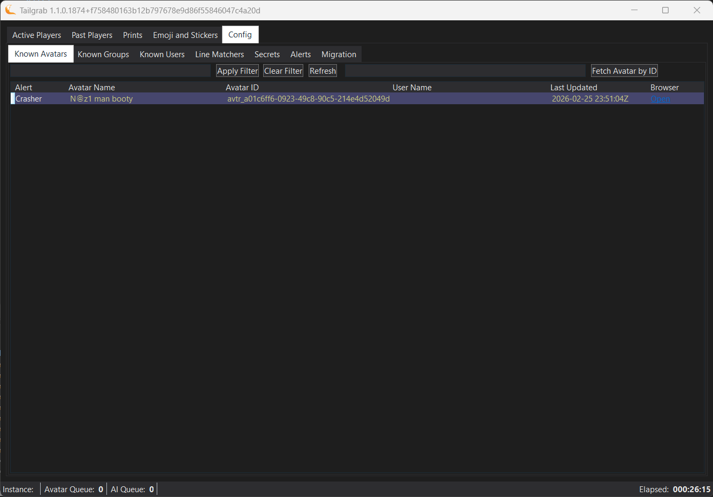

[Back](../README.md)
# Config - Avatars 

The avatars panel lets you mark avatars for alerting.  **At this time**, when you change the IsBOS value for an avatar, it will update the local database and trigger any alerting until you are in an instance with that **avatar name**.  This current version will mark the avatar as **GLOBALY BLOCKED** for the VRC Account credentials you are using to prevent crashers from using the avatar, but it will not prevent other users in the instance from using the avatar.  Use VRChat's Avatar web page to report bad avatars.

> [!NOTE]
> We will be changing the Avatar Flagging system in the future to be more flexible and allow for more user directed flagging options, such as "Warn Only", "Crasher" and "NONE".

You will notice a simular search and filter elements as the Active Players panel, this is to help you find the avatar in the local database by name or AvatarId.  

Next to the filter input and buttons is a field that accepts an avatar id, **avtr_1234...** and a button to "Add Avatar".  This is for adding avatars that you have been alerted to by the Avatar Watch community, this will add the record then filter the list to the added avatar name.

The list of avatars are shown below with the following columns:

- Avatar Name: The name of the avatar as reported in the VRChat logs.
- Avatar ID: The unique identifier for the avatar, this is the value you can use to add an avatar to the list for alerting.
- IsBOS: This is the value that will trigger the alerting for the avatar, if this is set to true, then you will get alerts for users using this avatar in your instance.  This is also the value that will mark the avatar as globally blocked for your VRC Account credentials, preventing crashers from using the avatar in your instance.
- Last Used: This is the last time this avatar was seen in your instance, this can help you identify if the avatar is currently being used by someone in your instance or if it was used in the past.
- Browser: This is a URL link to the avatar in the VRChat Avatar web page, this can help you quickly report the avatar if it is a bad avatar.

