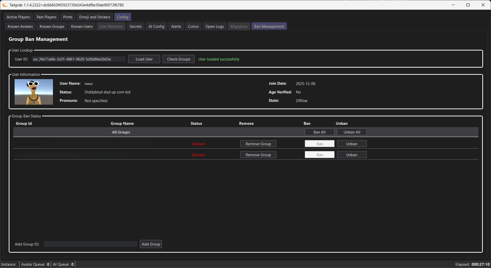

[Back](../README.md)
# Config - Ban Management

The Ban Management panel lets you manage user bans for groups you have rights to manage.

## You have two ways to access the Ban Management panel, either from the Config tab and then the Ban Management sub-tab, or any panel that has a user record view or user ownership view.

- You will need to click on a Ban button next to a user id or user record.  The Ban Management panel will open and load the user record for you to manage.

## Entering this page from the Tab
- Key/Paste the User ID into the UserID text box to search for a user to ban.  
- Click on 'Load User' to display the user basics under the lookup grouping, this should validate you are operating on the correct user.
- You can also view the user's group memberships and ban status in the Group Ban Status grouping.  This will show you the groups the user is a member of, and if you have rights to manage that group, you can ban or unban the user from that group.

## Banning a user from a group(s)
- The status relies on the group's permissions "Manage Group Bans" & "Manage Group Member Data" to determine if you can ban or unban a user from that group.  If you do not have rights to manage the status will be disabled.
- The remove group button removes the group from the management list.  You can add a group id on the bottom of the panel to add more groups you have ban privlidges to.
- Ban button will remove it from the group to the left of the button, and Unban will remove the ban from the group to the left of the button.
- Ban All and Unban All will perform the action on all groups you have rights to manage, it blindly performs the action on all groups, so be careful when using this option.

