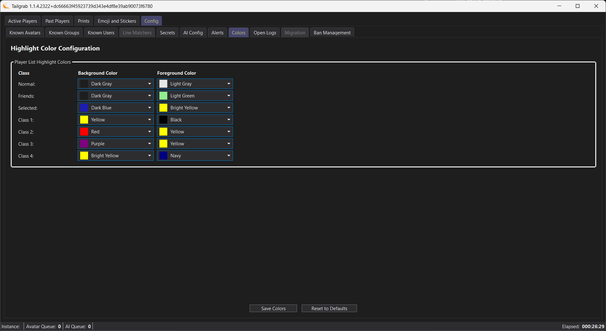

[Back](../README.md)
# Application Colors

The TailGrab Colors configuration panel is on the "Config" tab and then the "Colors" sub-tab.

## Color Classes 

Here you can customize the colors that are used for the application.  They are organized into classes for various record states.

- Normal - This is the default color for all records that are not flagged with a NONE severity level.
- Friends - This is the color for all records that are flagged with a FRIEND severity level.
- Selected - This is the color for all records that are selected in the list.
- Class 1 / Class 2 / Class 3 / Class 4 - These are the colors that you may set and re-use the color class on the Alert Levels configuration panel for Avatars, Groups and Profiles.  This allows you to set a color once and re-use it for multiple alert levels. See [Config_Alerts](./Config_Alerts.md) for more information on the Alert Levels configuration panel.

> [!NOTE]
> The Profile Alert Severity Levels are hard coded to:
>
> Harrassment & Bullying - **AlertTypeEnum.Nuisance**
>
> Sexual Content - **AlertTypeEnum.Nuisance**
>
> Self Harm - **AlertTypeEnum.Watch**