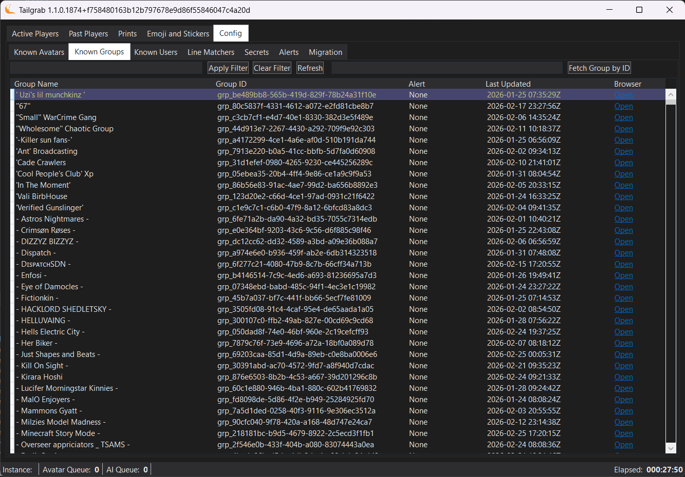

[Back](../README.md)
# Config - Groups 

The groups panel lets you mark groups for alerting.  **At this time**, when you change the IsBOS value for an group, it will update the local database and trigger any alerting until you are in an instance with a user that has that GroupId.

> [!NOTE]
> We will be changing the Group Flagging system in the future to be more flexible and allow for more user directed flagging options, such as "Warn Only", "Crasher" and "NONE".

You will notice a simular search and filter elements as the Active Players panel, this is to help you find the group in the local database by name or GroupId.  

Next to the filter input and buttons is a field that accepts an group id, **grp_1234...** and a button to "Add Group".  This is for adding groups that you have been alerted to by the Group Watch community, this will add the record then filter the list to the added group name.

The list of groups are shown below with the following columns:

- Group Name: The name of the group as reported in the VRChat logs.
- Group ID: The unique identifier for the group, this is the value you can use to add an group to the list for alerting.
- IsBOS: This is the value that will trigger the alerting for the group, if this is set to true, then you will get alerts for users having this group in your instance.  
- Last Used: This is the last time this group was added/updated by you.
- Browser: This is a URL link to the group in the VRChat Group web page, this can help you quickly report the Group if it is a bad actor.

