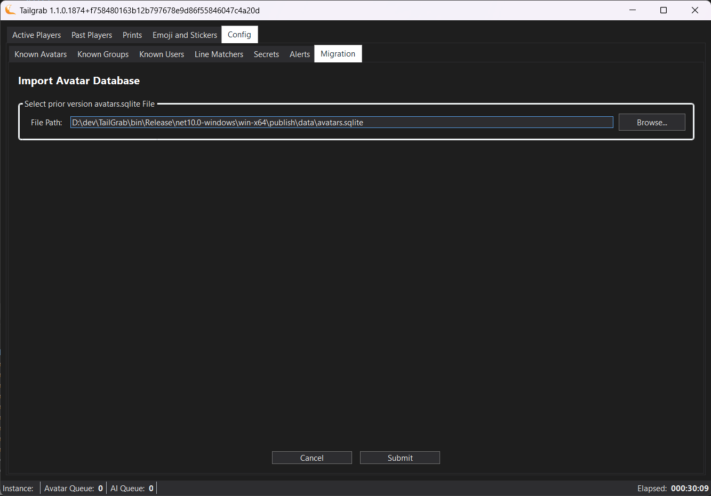
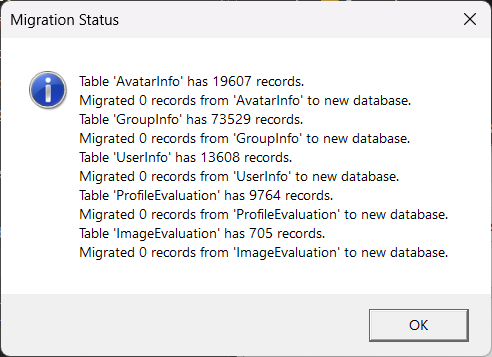

[Back](../README.md)
# Migration V1.0.9 to V1.1.0

Due to the new changes to the database structure and location of the application data, there is a migration process to move the existing data from the old database to the new database.  The migration process is a one time process that will move the existing data from the old database to the new database.  The migration process will also update the existing data to match the new database structure.

## Important Post Process Changes

The new structure converts the Boolean Yes/No fields to a Severity Level Enum with the following entities, by default the conversion will set all BOS Flagged records to Severity of "Watch" 

**Avatar Alert** - All BOS Flags set to "Watch"

**Group Alert** - All BOS Flags set to "Watch"

After selection of the database file from the original location, the migration process will automatically convert the existing data to match the new database structure and set the new Severity Level Enum to "Watch" for all records.  After the migration process is complete, a dialog will be shown to the user to inform them of the successful migration and the new location of the database file.  The user can then click "OK" to close the dialog and start using the application with the new database structure.

