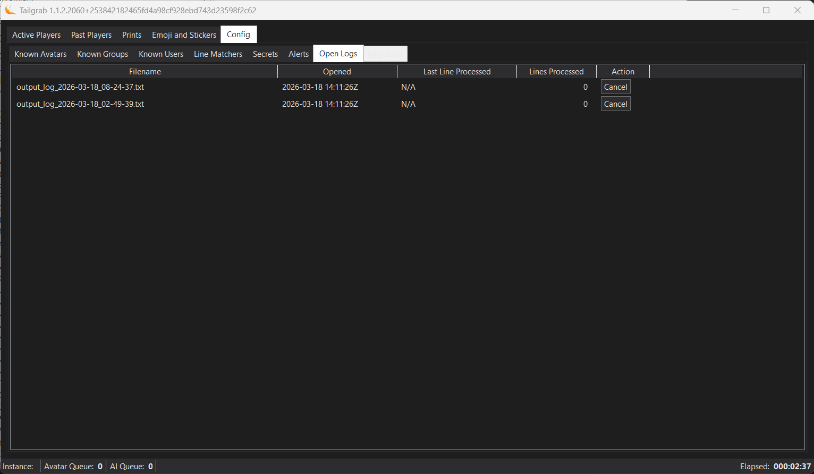

[Back](../README.md)
# Open Logs

New to V1.1.2; To help users to understand what logs are being used by TailGrab what has activity (Creation Date, Last Update and Lines Processed).  The action button can be used to close unused logs; especialy when you open and close VR Chat very often due to crashers or VR Chat's poor architecture that makes it unstable.

