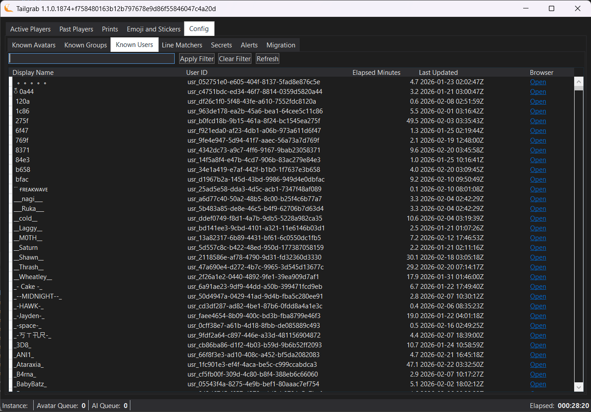

[Back](../README.md)
# Config - Users 

The Users panel lets you search users you have encountered.

You will notice a simular search and filter elements as the Active Players panel, this is to help you find the user in the local database by name or UserId.  

The list of users are shown below with the following columns:

- User Name: The name of the user as reported in the VRChat logs.
- User ID: The unique identifier for the user.
- Elapsed Minutes you personaly have seen the user with you.  
- Last Used: This is the last time this group was added/updated/seen.
- Browser: This is a URL link to the group in the VRChat User web page, this can help you quickly report the User if it is a bad actor.

