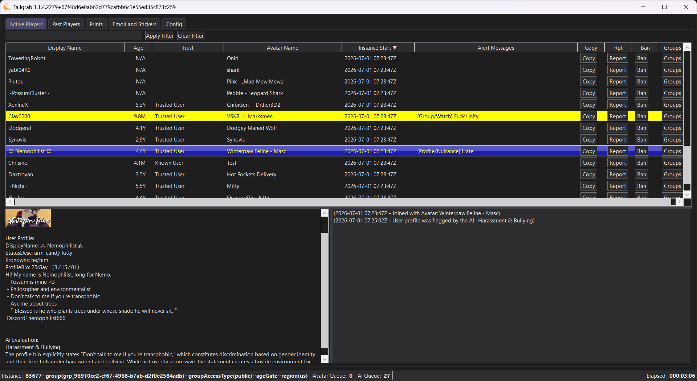
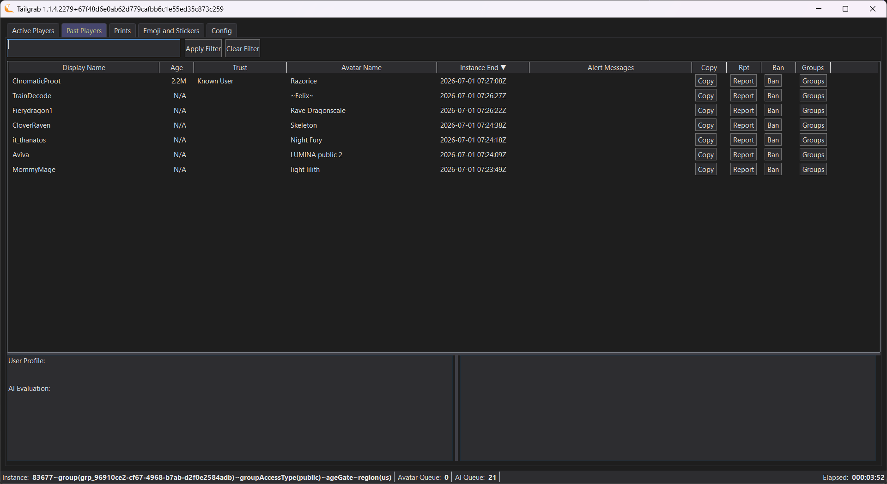
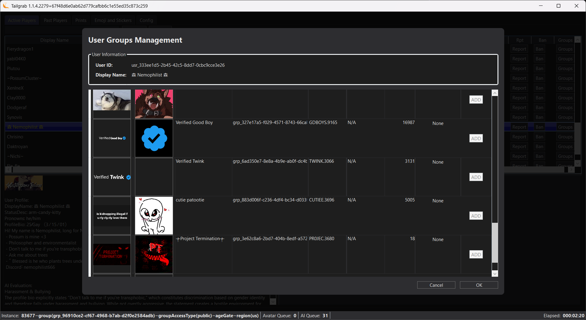
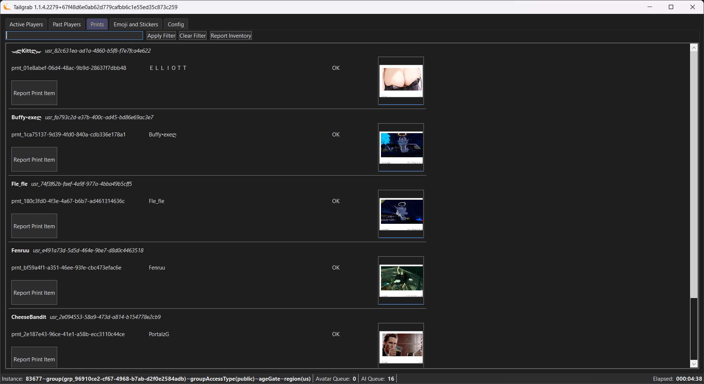
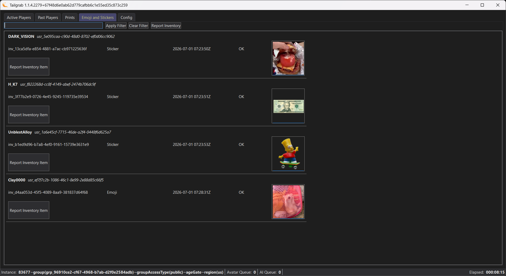

# V1.1.4 Change Log

[[toc]]

## UI Changes

### Active Players Page

- Added button to each player row to view player's groups and add them to the ban list if needed

### Past Players Page

- Added button to each player row to view player's groups and add them to the ban list if needed

### User Group Management Overlay (NEW!)

- New overlay to manage the groups of a user.  This overlay is accessible from the Active Players and Past Players pages by clicking the "Groups" button on a player row.

### Prints Page

- Twqeeked the layout of the prints page have a single scrollable list of prints instead of a multiple scrollbar lists.

### Emoji / Stickers Page

- Twqeeked the layout of the Emoji/Stickers page have a single scrollable list of prints instead of a multiple scrollbar lists.

### Config - Known Avatars Page

- Added button to purge records that are marked as 'None' on the Alert Level
- Added Detail Group section above the list to show the details of the selected avatar record
- Added a button on the detail group to ban the Uploaded of the Avatar record

### Config - Known Groups Page

- Added button to purge records that are marked as 'None' on the Alert Level
- Added a button on the detail group to ban the Owner of the Group record

### Config - Known Users Page

- Added button to purge records that are have not been seen in the last 60 days and have less than 15 minutes of activity in your monitored sessions

### Config - Secrets Page

- When you leave the OTP Seed field blank, the system will now prompt you on startup to enter the 6 Digit OTP Code from your authenticator app. This will happen once the Cookies expire of VRC invalidates all sessions.
 
### Config - Ban Management Page

- Added buttons to the top of the groups list that allow you to ban the selected user from all groups below.  Note that the process is blind and will report error for a group if the user is already in the target state (Banned/Unbanned)
 

